<h1 align="center">Jetpack Compose Animations</h1></br>

<p align="center">
  <a href="https://opensource.org/licenses/Apache-2.0"></a>
  <a href="https://android-arsenal.com/api?level=23"></a>
  <a href="https://github.com/skydoves"></a>
  <a href="https://github.com/doveletter"></a>
</p>

<p align="center">
Jetpack Compose animation playgrounds. Tweak literals at the top of any file, save, and watch the motion morph in front of you.
</p>

## Why this project

This project was built to tune and demonstrate Jetpack Compose animations on a real Android device, using [Compose HotSwan](https://hotswan.dev/) as the live editing loop. Animations are physical: a damping ratio of 0.6 versus 0.8, an easing of `FastOutSlowIn` versus `EaseOutBack`, a particle gravity of 1100 vs. 1800. None of those choices reads off the page. You feel them on the device, and the only way to find the right number is to keep changing it and looking at the result.

Every example here is a single composable file with its tunable values named as `val`s at the top of the function: durations, easings, stiffness, color palettes, particle counts. You change a number, save the file, and the running app picks up the new value within milliseconds, without rebuilding the project or losing your place in the navigation stack. The thinking behind this loop and how it changes the way you author animations is covered in [Compose Animation: Hot Reload](https://hotswan.dev/blog/compose-animation-hot-reload).

You can also run this app as a regular Compose project without Compose HotSwan, but the per parameter tuning loop is what the examples are designed around. In this repository, you'll find multiple self contained examples covering core animation APIs (`animate*AsState`, `AnimatedContent`, `AnimatedVisibility`, `Animatable`, `rememberInfiniteTransition`, `updateTransition`, `SharedTransitionLayout`), gesture driven motion, `Canvas` simulations, and physical effects.

### Compose Hot Reload

To edit values and see changes live without rebuilding:

1. Install the Compose HotSwan plugin following the [install guides](https://hotswan.dev/install), or expand the section below for the same steps inline.
2. Run this project, and start Compose HotSwan.
3. Open any animation example file and edit the constants near the top of the function.
4. Save the file. Done. You will see the Compose UI is changing on a running Android app without re-compiling, re-installing, or re-navigating, just in ~100ms.

<details>
<summary><strong>Or follow the below instructions</strong></summary>

<br/>

**1. Install the IDE Plugin**

Open your JetBrains IDE (Android Studio or IntelliJ IDEA), go to **Settings → Plugins → Marketplace**, and search for **"Compose HotSwan"**. Click Install and **restart the IDE**.

You can also install it directly from the [JetBrains Marketplace](https://plugins.jetbrains.com/plugin/30551-compose-hotswan/).


> **Kotlin Multiplatform?** If your project uses Kotlin Multiplatform, see the [Kotlin Multiplatform](https://hotswan.dev/docs/kotlin-multiplatform) guide for KMP specific setup and module configuration.

**2. Configure Gradle**

Add the HotSwan compiler plugin to your project. Three files need to be updated.

`libs.versions.toml`:

```toml
[plugins]
hotswan-compiler = { id = "com.github.skydoves.compose.hotswan.compiler", version = "1.3.0" }
```

Root `build.gradle.kts`:

```kotlin
alias(libs.plugins.hotswan.compiler) apply false
```

App module `build.gradle.kts`:

```kotlin
alias(libs.plugins.hotswan.compiler)
```

> **IDE and Gradle versions must match.** The Gradle plugin version must match the IDE plugin version. When you update the IDE plugin, update the version in `libs.versions.toml` as well.

**3. Build and Run Your App**

Build and run your app normally with the **Run** button. The Gradle plugin auto configures everything needed for hot reload in debug builds, no additional setup required.

**4. Start HotSwan**

Open the HotSwan panel via **View → Tool Windows → HotSwan**. Select your target device and click **Start**. The status will change to **READY**.

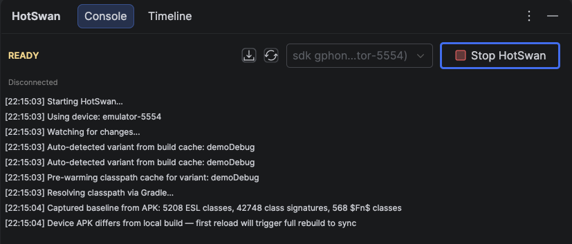

Once your app is running on the device, HotSwan connects automatically and the status changes to **WATCHING**.

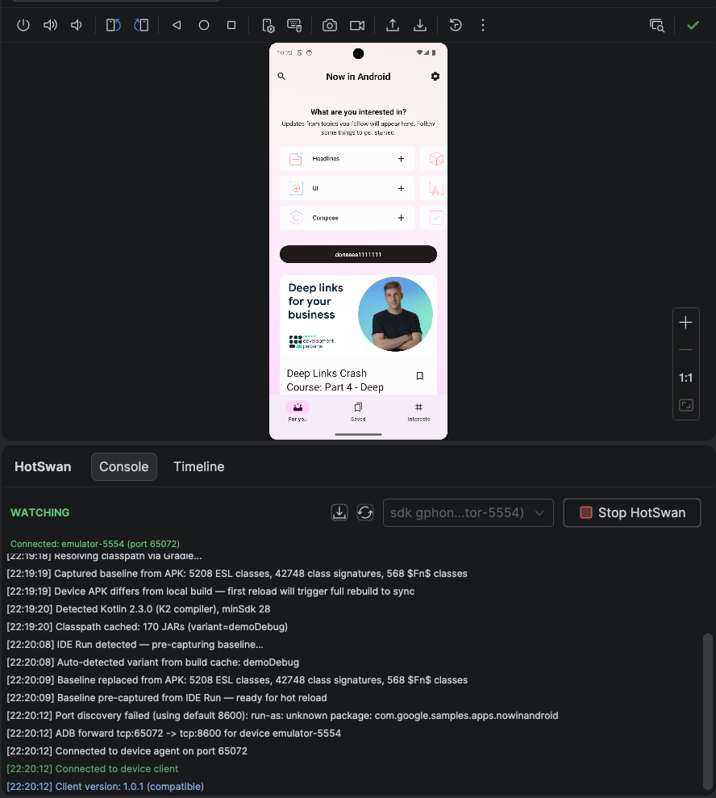

**5. Start Hot Reloading**

Edit any Kotlin file and save (`Cmd+S` / `Ctrl+S`). HotSwan detects the change, compiles only the modified code, and applies the update to your running app. Your UI updates instantly without losing any state.

</details>

If you skip step 1, the app still runs as a normal Compose app.

## Animation Gallery

Each example below is a single file. Open the source link to see the constants you can tweak.

### 1. Animate Content Size

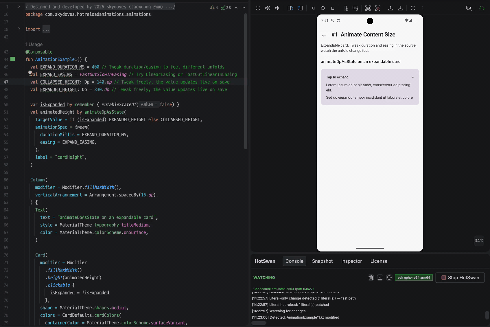

Expandable card that morphs height between two `Dp` values. Uses `animateDpAsState` with `tween` so the unfold timing reads as a single curve.

**Try tweaking:** `EXPAND_DURATION_MS`, `EXPAND_EASING`, `COLLAPSED_HEIGHT`, `EXPANDED_HEIGHT`.
**Source:** [`AnimationExample1.kt`](app/src/main/kotlin/com/skydoves/hotreloadanimations/animations/AnimationExample1.kt)


### 2. Animated Visibility

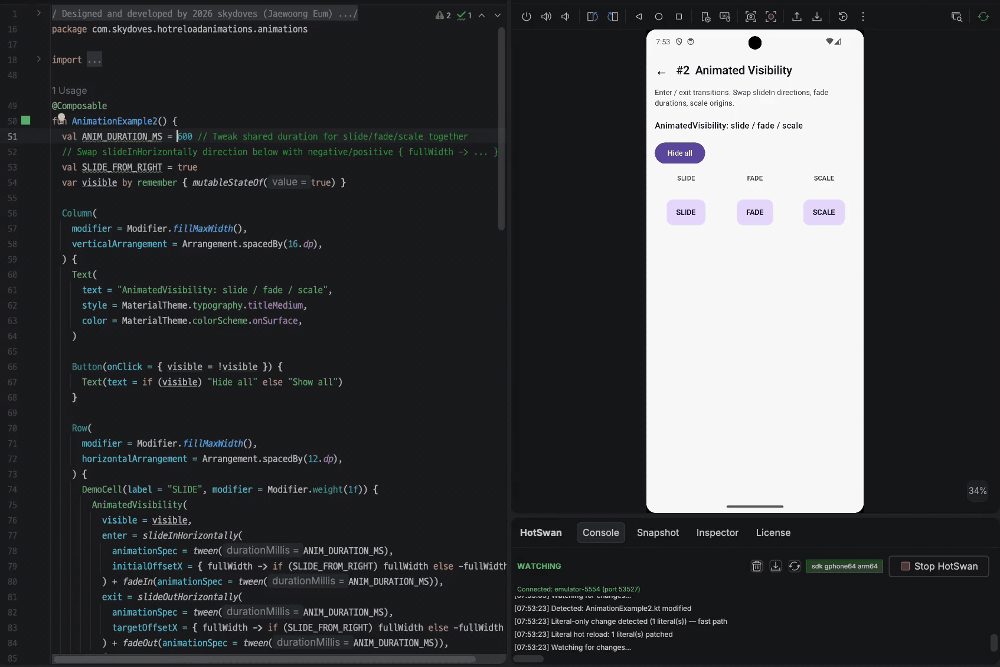

Enter and exit transitions composed from `slideIn`, `fadeIn`, `scaleIn`. A toggle flips the visibility, the spec defines the choreography.

**Try tweaking:** `ANIM_DURATION_MS`, `SLIDE_FROM_RIGHT`, the chosen `slideIn` / `fadeIn` / `scaleIn` combinators.
**Source:** [`AnimationExample2.kt`](app/src/main/kotlin/com/skydoves/hotreloadanimations/animations/AnimationExample2.kt)


### 3. Color State Morph

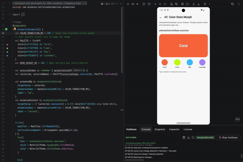

`animateColorAsState` walking through a palette of named theme colors. Pick a swatch, the background and accents follow.

**Try tweaking:** `COLOR_TRANSITION_MS`, the entries inside `PALETTE`.
**Source:** [`AnimationExample3.kt`](app/src/main/kotlin/com/skydoves/hotreloadanimations/animations/AnimationExample3.kt)


### 4. FAB Spring Morph

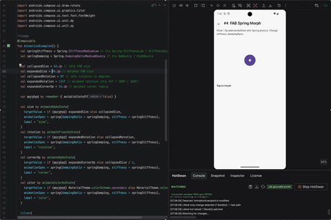

A floating action button that grows, rotates, and shifts color when toggled. Scale, corner radius, rotation, and color all run through `animateAsState` with `spring`.

**Try tweaking:** `springStiffness`, `springDampingRatio`, target sizes and corners.
**Source:** [`AnimationExample4.kt`](app/src/main/kotlin/com/skydoves/hotreloadanimations/animations/AnimationExample4.kt)


### 5. Animated Counter

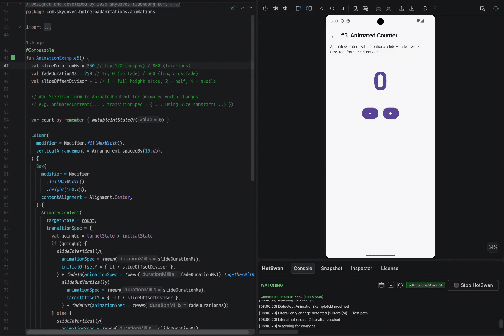

A number counter that slides and fades between values using `AnimatedContent`. The transition direction follows whether the count went up or down.

**Try tweaking:** `slideOffsetDivisor`, slide and fade durations, the `SizeTransform` easing.
**Source:** [`AnimationExample5.kt`](app/src/main/kotlin/com/skydoves/hotreloadanimations/animations/AnimationExample5.kt)


### 6. Crossfade Switcher

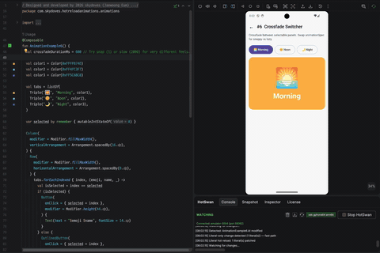

`Crossfade` between three selectable panels. The animation spec controls how snappy or lazy the swap feels.

**Try tweaking:** the `animationSpec` passed to `Crossfade`, the panel content.
**Source:** [`AnimationExample6.kt`](app/src/main/kotlin/com/skydoves/hotreloadanimations/animations/AnimationExample6.kt)


### 7. Pulsing Heart

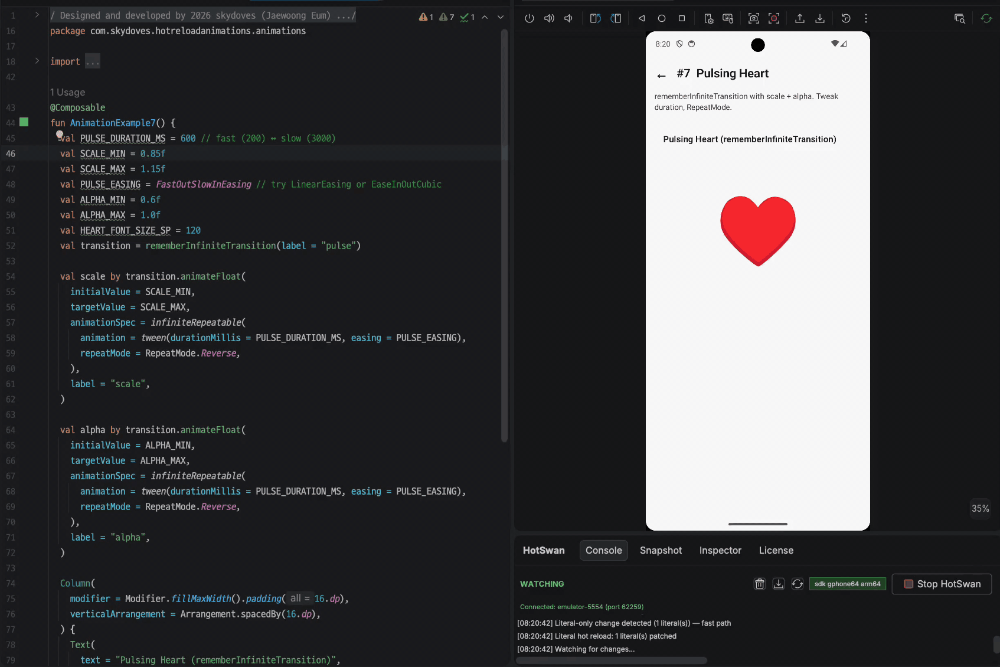

`rememberInfiniteTransition` driving scale and alpha at the same time. The result is a soft heartbeat with a bright on, dim off rhythm.

**Try tweaking:** `PULSE_MIN_SCALE`, `PULSE_MAX_SCALE`, `PULSE_DURATION_MS`, `RepeatMode`.
**Source:** [`AnimationExample7.kt`](app/src/main/kotlin/com/skydoves/hotreloadanimations/animations/AnimationExample7.kt)


### 8. Custom Loading Spinner

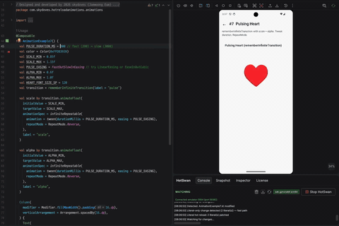

A loading indicator built from infinite rotation plus a color sweep. Shows how to layer two infinite transitions on the same `graphicsLayer`.

**Try tweaking:** rotation duration, color list, sweep keyframes.
**Source:** [`AnimationExample8.kt`](app/src/main/kotlin/com/skydoves/hotreloadanimations/animations/AnimationExample8.kt)


### 9. Spring Drag Box

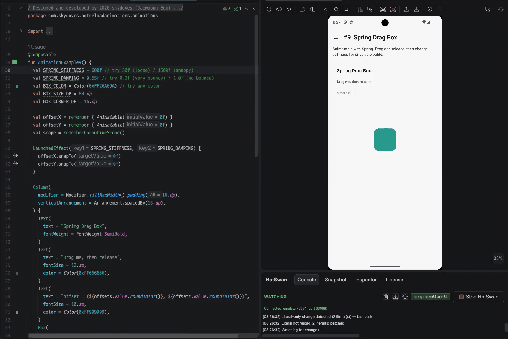

A box you can drag with `pointerInput`, then release to spring back to origin via `Animatable.animateTo`. Tuning stiffness flips the feel between snap and wobble.

**Try tweaking:** `SPRING_STIFFNESS`, `SPRING_DAMPING`, the target position on release.
**Source:** [`AnimationExample9.kt`](app/src/main/kotlin/com/skydoves/hotreloadanimations/animations/AnimationExample9.kt)


### 10. Easing Showcase

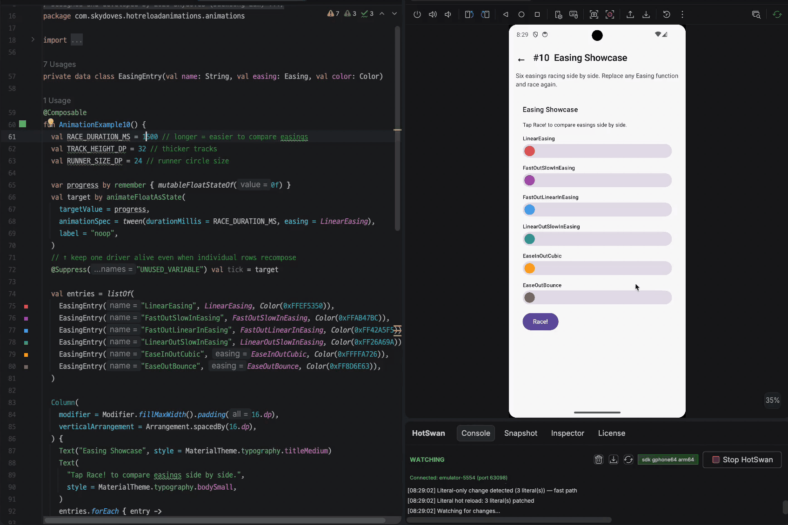

Six runners race side by side, each using a different `Easing`. The strip makes the difference between linear, ease in, ease out, fast out slow in, anticipate, overshoot visible at a glance.

**Try tweaking:** swap any `Easing` function in the entries list, change `RACE_DURATION_MS`.
**Source:** [`AnimationExample10.kt`](app/src/main/kotlin/com/skydoves/hotreloadanimations/animations/AnimationExample10.kt)


### 11. Play / Pause Morph

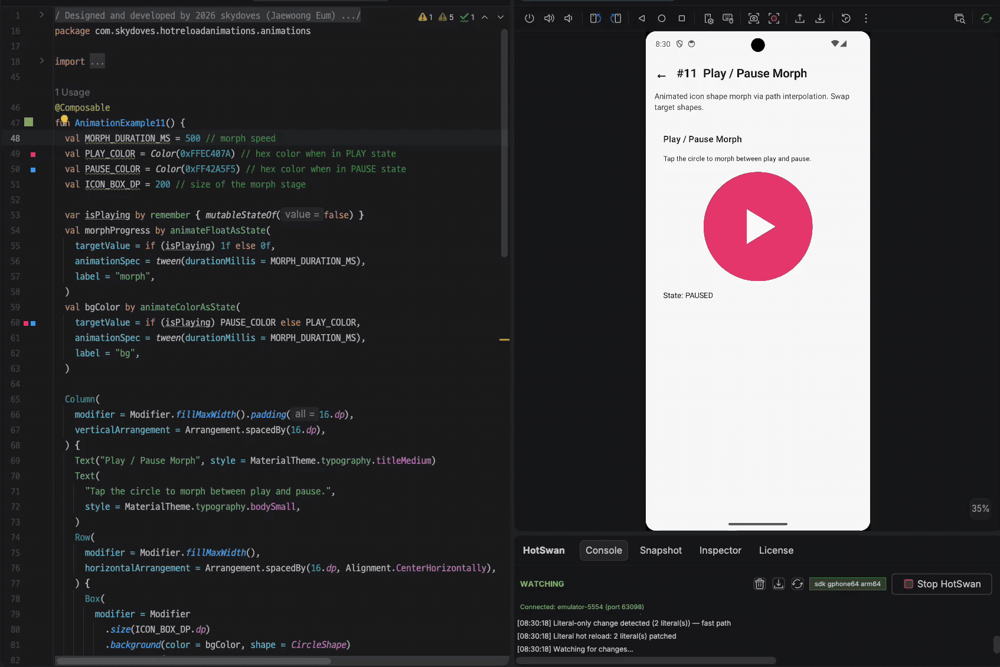

A play triangle that morphs into a pause pair through `Path` interpolation on a `Canvas`. The shape itself is the animation, no sprite swap.

**Try tweaking:** `MORPH_DURATION_MS`, the source and target path coordinates, fill colors.
**Source:** [`AnimationExample11.kt`](app/src/main/kotlin/com/skydoves/hotreloadanimations/animations/AnimationExample11.kt)


### 12. Shared Bounds Expansion

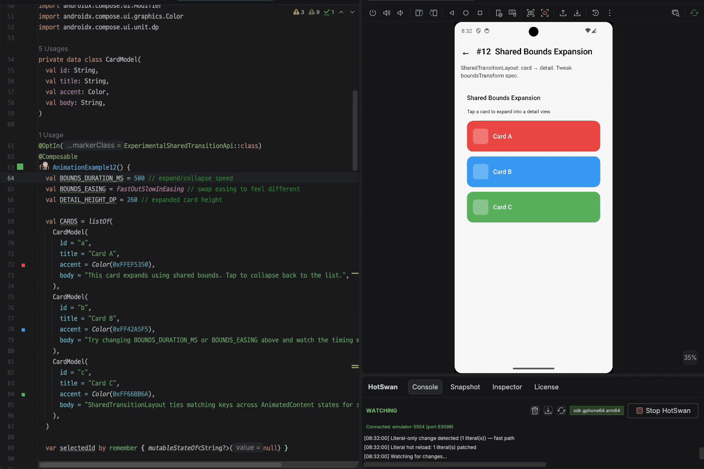

Tap a card and watch it expand into a detail view through `SharedTransitionLayout`. Matching keys on the source and destination tie their bounds together.

**Try tweaking:** `BOUNDS_DURATION_MS`, `BOUNDS_EASING`, `DETAIL_HEIGHT_DP`, the card list.
**Source:** [`AnimationExample12.kt`](app/src/main/kotlin/com/skydoves/hotreloadanimations/animations/AnimationExample12.kt)


### 13. Swipeable Cards

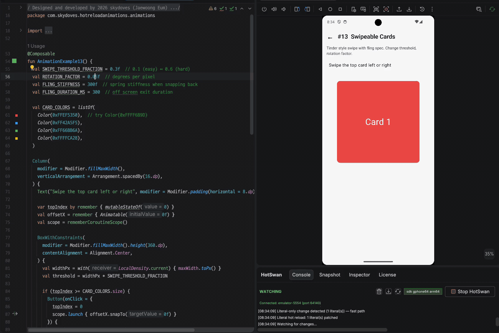

A Tinder style card stack. Drag past the threshold and the card flings off, tilted by a rotation factor proportional to the offset.

**Try tweaking:** `SWIPE_THRESHOLD_FRACTION`, `ROTATION_FACTOR`, `FLING_STIFFNESS`, `FLING_DURATION_MS`.
**Source:** [`AnimationExample13.kt`](app/src/main/kotlin/com/skydoves/hotreloadanimations/animations/AnimationExample13.kt)


### 14. Radial FAB Menu

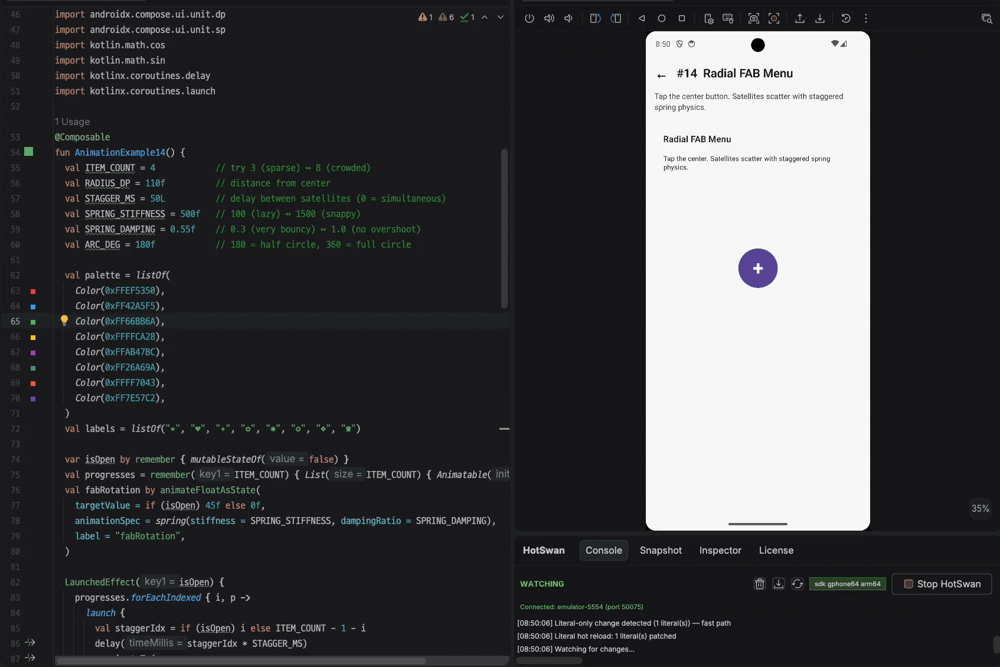

A floating action button that explodes into satellite buttons along an arc. Each satellite has its own `Animatable`, animated through a spring with a per index stagger delay so the menu unfurls and refolds.

**Try tweaking:** `ITEM_COUNT`, `RADIUS_DP`, `STAGGER_MS`, `SPRING_STIFFNESS`, `SPRING_DAMPING`, `ARC_DEG`.
**Source:** [`AnimationExample14.kt`](app/src/main/kotlin/com/skydoves/hotreloadanimations/animations/AnimationExample14.kt)


### 15. 3D Card Flip

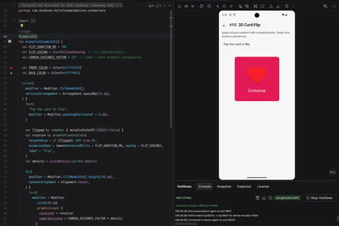

A card that flips in 3D using `graphicsLayer.rotationY` with a tuned `cameraDistance`. The front and back swap content at 90 degrees.

**Try tweaking:** `FLIP_DURATION_MS`, `CAMERA_DISTANCE`, the front and back colors.
**Source:** [`AnimationExample15.kt`](app/src/main/kotlin/com/skydoves/hotreloadanimations/animations/AnimationExample15.kt)


### 16. Confetti Burst

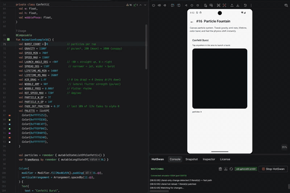

Tap anywhere in the canvas and a one shot burst of rotating paper rectangles erupts from that point. Each piece carries its own velocity, rotation speed, lateral wobble, lifetime, and color. Multiple bursts stack on top of each other.

**Try tweaking:** `BURST_COUNT`, `GRAVITY`, `SPEED_MIN/MAX`, `SPREAD_DEG`, `LAUNCH_ANGLE_DEG`, `AIR_DRAG`, `WOBBLE_AMP`, `ROT_SPEED_MAX`, `PALETTE`.
**Source:** [`AnimationExample16.kt`](app/src/main/kotlin/com/skydoves/hotreloadanimations/animations/AnimationExample16.kt)


### 17. Wave Field

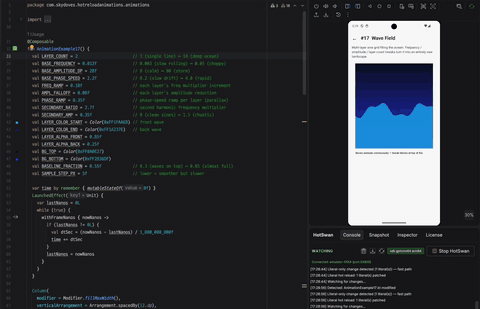

Multiple sine wave layers stacked for parallax, each driven by its own phase, frequency, and amplitude ramps. Looks like a calm sea or a storm depending on the constants.

**Try tweaking:** `BASE_AMPLITUDE_DP`, `BASE_PHASE_SPEED`, `FREQ_RAMP`, `AMPL_FALLOFF`, `LAYER_COUNT`.
**Source:** [`AnimationExample17.kt`](app/src/main/kotlin/com/skydoves/hotreloadanimations/animations/AnimationExample17.kt)


### 18. Metaball Liquid

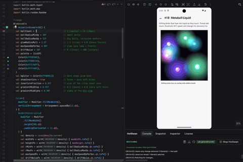

Drifting blobs that fuse into a single liquid mass when they overlap. The fusion comes from additive blend on stacked radial gradients.

**Try tweaking:** `ballCount`, `ballRadiusMin/MaxDp`, `glowRadiusMult`, `maxSpeedDpPerSec`, `driftNoise`.
**Source:** [`AnimationExample18.kt`](app/src/main/kotlin/com/skydoves/hotreloadanimations/animations/AnimationExample18.kt)


### 19. Mesh Aurora

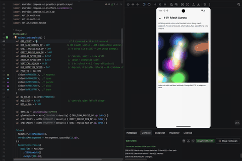

Color orbs orbit on elliptical paths, additive blended into a living mesh gradient. Hue rotation cycles the entire palette over time.

**Try tweaking:** `ORB_COUNT`, `ORB_GLOW_RADIUS_DP`, `ORBIT_RADIUS_MIN/MAX_DP`, `HUE_ROTATION_SPEED`, `PALETTE`.
**Source:** [`AnimationExample19.kt`](app/src/main/kotlin/com/skydoves/hotreloadanimations/animations/AnimationExample19.kt)


### 20. Pendulum Wave

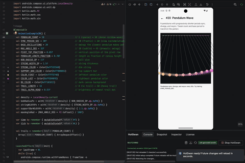

N pendulums with progressively shorter periods. They start in phase, drift apart into apparent chaos, and resync at the period boundary.

**Try tweaking:** `PENDULUM_COUNT`, `BASE_PERIOD_SEC`, `SYNC_PERIOD_SEC`, the bob colors.
**Source:** [`AnimationExample20.kt`](app/src/main/kotlin/com/skydoves/hotreloadanimations/animations/AnimationExample20.kt)


### 21. Rainy

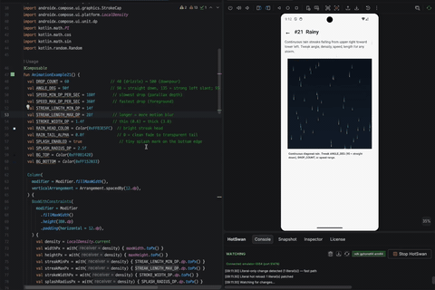

Continuous rain streaks falling at an angle, with depth based parallax and optional ground splash marks.

**Try tweaking:** `DROP_COUNT`, `ANGLE_DEG`, `SPEED_MIN/MAX_DP_PER_SEC`, `STREAK_LENGTH`, `SPLASH_ENABLED`.
**Source:** [`AnimationExample21.kt`](app/src/main/kotlin/com/skydoves/hotreloadanimations/animations/AnimationExample21.kt)


## [Tuning Compose Animations Without Rebuilding: Hot Reload for Dynamic Design](https://hotswan.dev/blog/compose-animation-hot-reload)

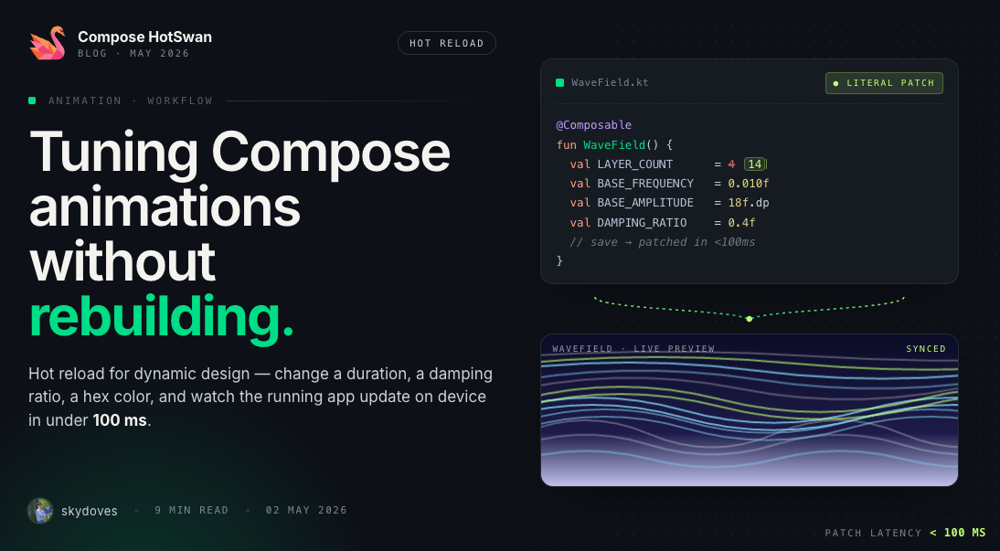

With Compose hot reload, you change the value, save, and the animation plays with the new value on your running device in under a second. No rebuild. No restart. No navigating back. You stay on the exact screen, the exact state, and see the exact difference between the old value and the new one. This turns animation tuning from a guessing game into a visual, iterative process.

[In this article](https://hotswan.dev/blog/compose-animation-hot-reload), you will explore four real world examples of animation development with hot reload: content size transitions, grid item animations, custom wave motion, and animation spec tuning.

## Find this project useful? :heart:

Support it by joining [stargazers](https://github.com/skydoves/compose-animations/stargazers) for this repository. :star: <br>
Also, [follow me](https://github.com/skydoves) on GitHub for my next creations.

# License

```xml
Designed and developed by 2026 skydoves (Jaewoong Eum)

Licensed under the Apache License, Version 2.0 (the "License");
you may not use this file except in compliance with the License.
You may obtain a copy of the License at

   http://www.apache.org/licenses/LICENSE-2.0

Unless required by applicable law or agreed to in writing, software
distributed under the License is distributed on an "AS IS" BASIS,
WITHOUT WARRANTIES OR CONDITIONS OF ANY KIND, either express or implied.
See the License for the specific language governing permissions and
limitations under the License.
```
